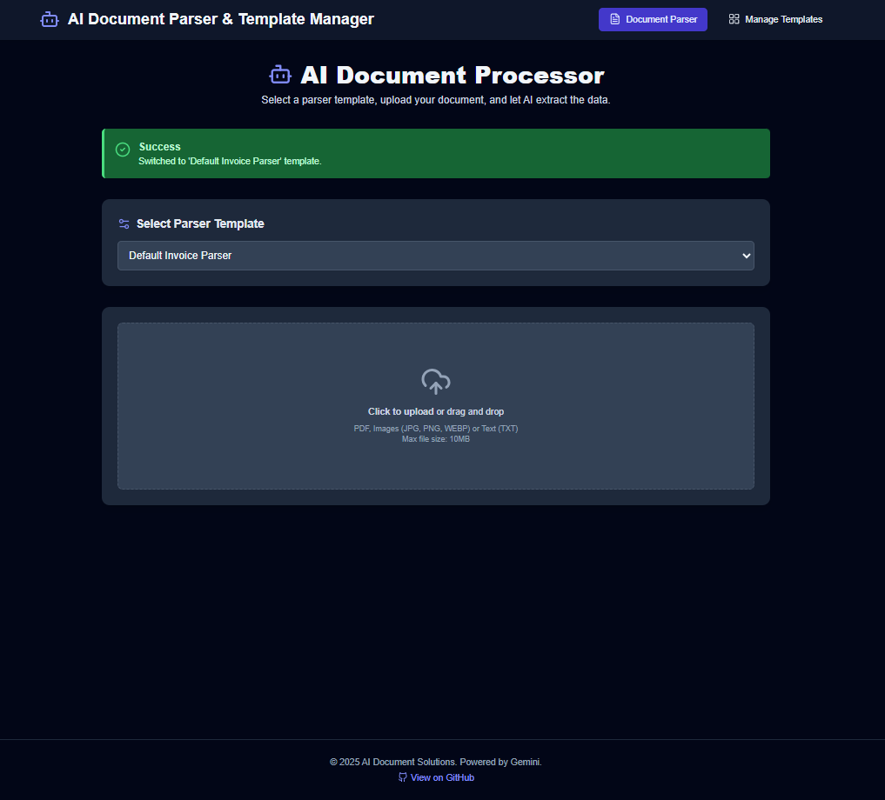
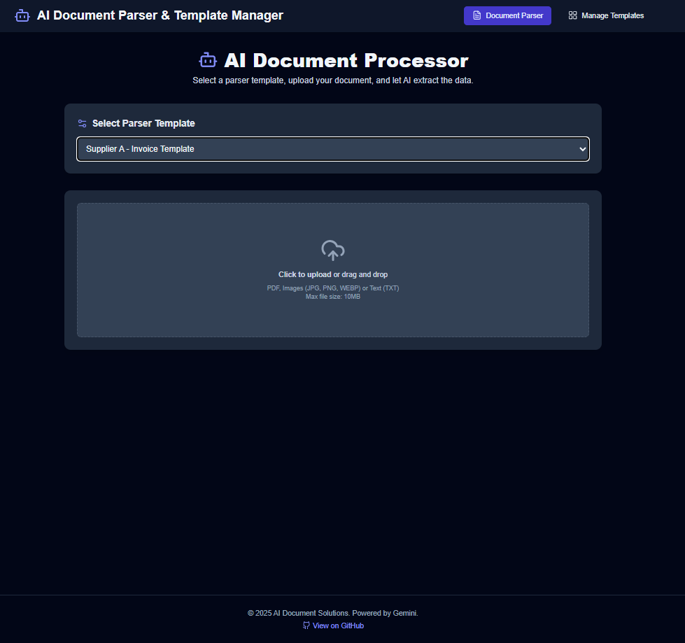
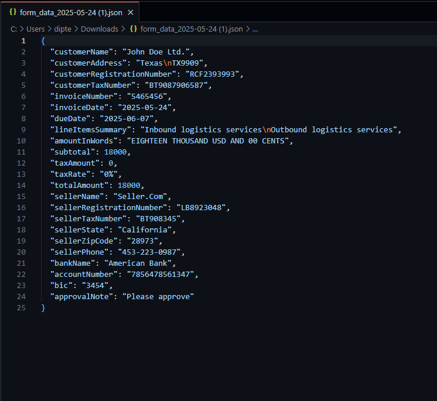

# Run and deploy your AI Studio app

This contains everything you need to run your app locally.

## Run Locally

**Prerequisites:**  Node.js


1. Install dependencies:
   `npm install`
2. Set the `GEMINI_API_KEY` in [.env.local](.env.local) to your Gemini API key
3. Run the app:
   `npm run dev`

## Starting Folder

To get started with the application, navigate to the root folder of the project:

```
cd e:\aivolutionaryai-ai-document-paser-form-input-data-pipeline
```

This is where you will find all the necessary files and folders to run and develop the application.

## Screenshots

Below are the screenshots of the application, demonstrating its features and functionality:

1. **Manage Parser Template**
   

2. **Manage Parser Extracted Schema JSON**
   

3. **AI Document Processor**
   

4. **Select Template Processor**
   

5. **Completed Form As Per Template**
   - Step 1:
     
   - Step 2:
     
   - Step 3:
     

6. **Saved File As JSON**
   
